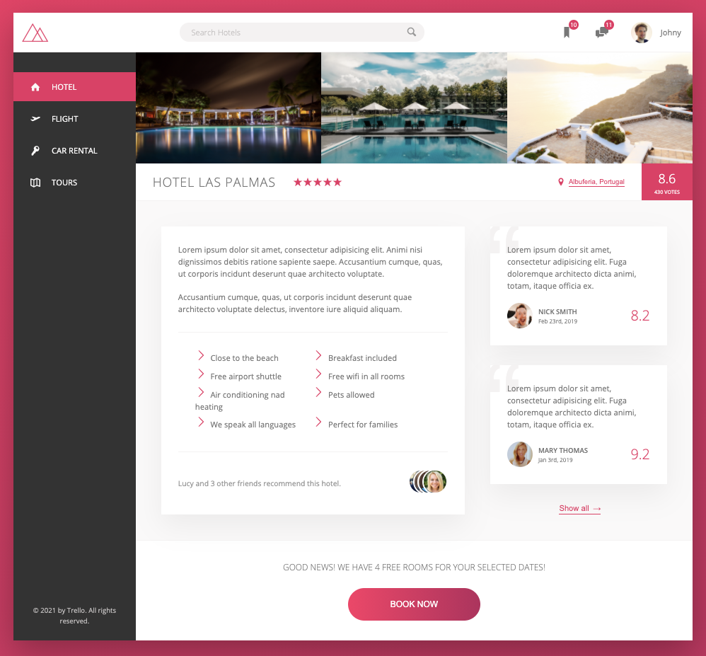
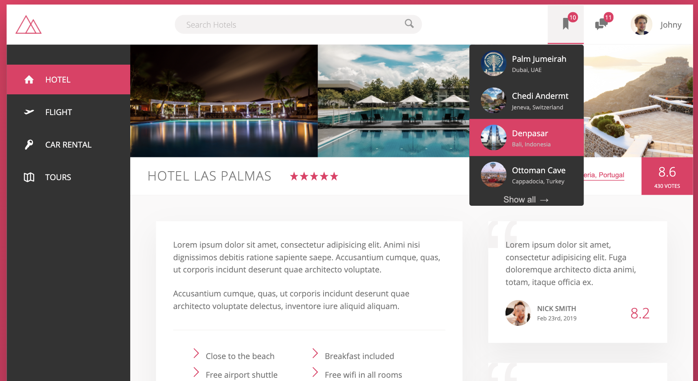

## Live Preview

https://milano-patel.github.io/trello-travel/

## UI Design

- Installing node-sass module, and npm package
- How to setup package.json and write script to automatically compile scss file to css file
- BEM CSS pattern for easy selector nesting in scss file
- CSS variables
- Proper organization of sass files using partials
- Layout designed using Flexbox
- Media queries for responsive design

## Credit

- Advanced CSS and Sass: Flexbox, Grid, Animations and More! by Jonas Schmedtmann See course [link in Udemy](https://www.udemy.com/course/advanced-css-and-sass/)
